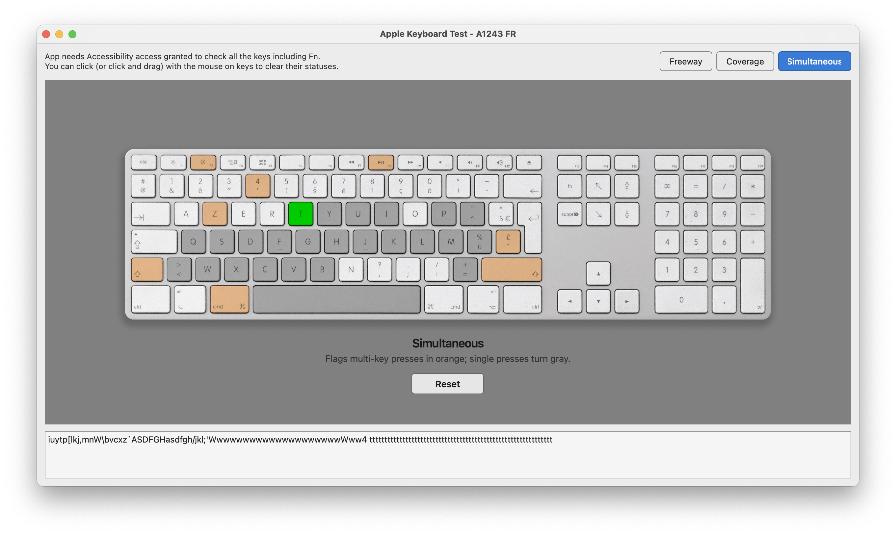
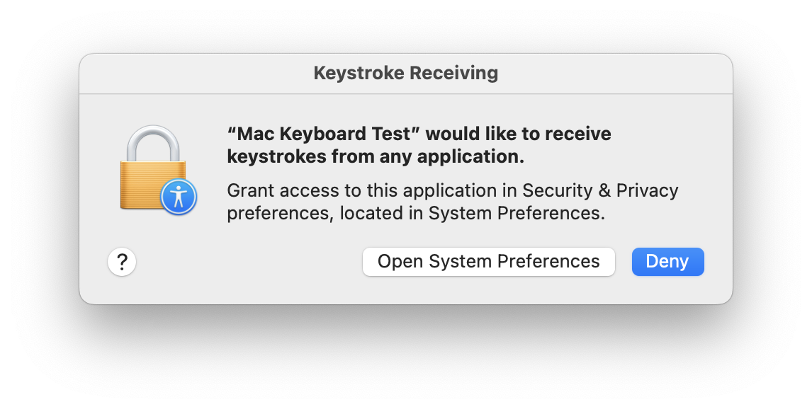

# Apple Keyboard Test - A1243 FR

A macOS tool for testing an Apple A1243 French (AZERTY) keyboard.

Press keys and see them light up on an on-screen layout. Capture uses CGEventTap so you get the full range of key events (letters, modifiers, Fn, media, and brightness).



## Test modes

- **Freeway** - Live highlight while keys are held.
- **Coverage** - Marks every key you press (pale blue) so you can see what's been tested.
- **Simultaneous** - Flags multi-key presses in orange; single presses turn gray.

In Coverage and Simultaneous, use **Reset** to clear all marks, or click / click-and-drag on keys to clear individual statuses.

A read-only typed preview at the bottom shows characters as macOS would type them (Shift, Backspace, etc.).

## Permissions (required)

**Input Monitoring / keystrokes must be enabled** for **Mac Keyboard Test** to work, otherwise Fn and many other keys cannot be observed. Grant access in **System Settings → Privacy & Security → Input Monitoring**, and allow the app (or your terminal / Python) when prompted:



```bash
python main.py
```

## Icon credit

App icon from the [Apple Keyboard Icons](https://www.softicons.com/social-media-icons/apple-keyboard-icons-by-creative-ninja/apple-icon) set by [Creative Ninja](https://creativeninjas.com/) (SoftIcons). Free license; commercial use allowed; link to the author's website required.
